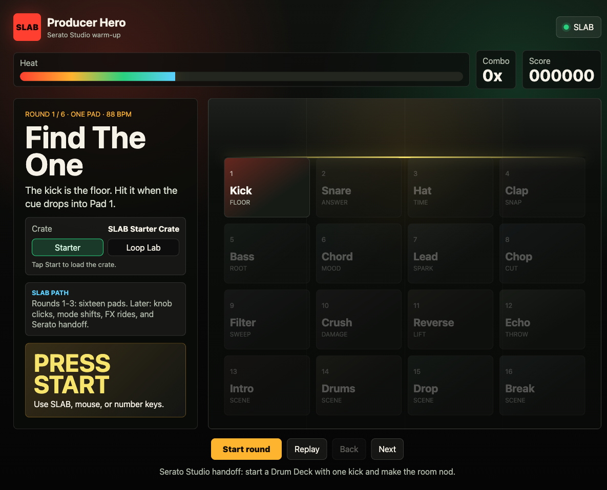

# Producer Hero: Serato - Educational Music Game



Producer Hero is a fast, welcoming beat-making trainer that turns a 16-pad music controller into an arcade rhythm game.

The point is immediate musical confidence: choose a crate, start a round, hit the glowing pads on time, build heat, unlock bigger producer moves, then carry the idea into Serato Studio or another real music tool.

This prototype is designed around the **AlphaTheta SLAB** controller because its 16-pad surface is perfect for teaching drums, chops, FX, scenes, and later knob-click performance. The code is intentionally adaptable: any MIDI pad controller can be mapped by changing the MIDI device name and pad mapping logic.

> Not affiliated with or endorsed by Serato, AlphaTheta, or Pioneer DJ. This is an educational prototype and pitch artifact.

## What It Teaches

- **Round 1: Find The One** - kick timing and the downbeat.
- **Round 2: Call And Answer** - kick/snare bounce.
- **Round 3: Make The Pocket** - hats and claps without overwhelming the player.
- **Round 4: Add Sauce** - bass, chords, leads, and chops.
- **Round 5: Sick Breakdown** - FX drama and transitions.
- **Round 6: Full Surface** - all 16 pads as a tiny performance set.

The scoring language is producer-first, not classroom-first: `LOCKED`, `BOUNCE`, `IN THE POCKET`, `SAUCE`, `SICK BREAKDOWN`, `DROP HIT`, and `SERATO READY`.

## Quick Start For Anyone

You only need Node.js and this folder.

1. Install Node.js 20 or newer from https://nodejs.org
2. Download this repository as a ZIP from GitHub.
3. Unzip it somewhere easy, like Desktop.
4. Open Terminal or Command Prompt in the unzipped folder.
5. Run:

```bash
npm install
npm run dev
```

6. Open the link printed in the terminal:

```text
http://127.0.0.1:5173/
```

You can play with mouse, keyboard, or a MIDI controller.

Keyboard controls:

```text
Pads 1-10: 1 2 3 4 5 6 7 8 9 0
Pads 11-16: q w e r t y
Start: Space
Rounds: Left Arrow / Right Arrow
```

## Using AlphaTheta SLAB

1. Plug in SLAB before starting the app.
2. Run:

```bash
npm install
npm run dev
```

3. The local MIDI bridge will look for a device with `SLAB` in its name.
4. Open `http://127.0.0.1:5173/`.
5. Hit the pads. The browser should show `SLAB` or `Bridge connected`.

To inspect MIDI ports:

```bash
npm run midi:list
```

To listen to raw MIDI input:

```bash
npm run midi:listen
```

## Using Another MIDI Pad Controller

Producer Hero can run with other pad controllers.

Find your device name:

```bash
npm run midi:list
```

Start the app with your controller name:

```bash
MIDI_DEVICE_NAME="Your Controller Name" npm run dev
```

If the pads trigger the wrong order, edit `midiMessageToPad()` in `src/app.js`. That is the main mapping layer between physical MIDI messages and the 16 game pads.

## Sound Crates

The prototype ships with two small CC0 crates:

- **SLAB Starter Crate** - drum one-shots plus quick color sounds.
- **Public Domain 140** - basslines, loops, synth shots, pads, and percussion.

Sample sources:

- CM Music Drum Kit Samples: https://ccmixter.org/files/CarbonMonoxideMusic/23425
- Liquid_Tribal Public Domain Sound Library Volume 3: https://ccmixter.org/files/Liquid_Tribal/64233
- CC0 1.0 Universal: https://creativecommons.org/publicdomain/zero/1.0/

The application code is licensed under **AGPL-3.0-only**. The bundled sample crates remain **CC0** and include source/license notes in `public/samples/crates/`.

## Why This Exists

Most music tools ask a beginner to understand software before they feel musical. Producer Hero flips that.

It starts with the body: hit the pad, hear the sound, catch the beat, get a badge, try the next round. After confidence builds, the game explains the matching Serato Studio move: Drum Deck, Step Sequencer, Piano Mode, Trigger Mode, FX, and Scenes.

The long-term product idea is a bridge between play and production: a training game that makes people want to open Serato Studio and actually finish a song.

## Privacy And Hardware Notes

This public repo does not include local machine paths, screenshots from private sessions, hardware serials, or hard-coded USB vendor/product IDs.

The included MIDI/HID tools choose devices by visible name. Use environment variables when customizing:

```bash
MIDI_DEVICE_NAME="SLAB" npm run dev
HID_DEVICE_NAME="SLAB" npm run hid:list
```

## Roadmap

- Knob-click lessons for FX, filters, and scene control.
- SLAB-specific advanced levels for encoders, mode shifts, and performance gestures.
- A cleaner controller mapping editor for non-technical users.
- Custom crate importer for local WAV/MP3 files.
- Serato Studio handoff cards after each completed round.
